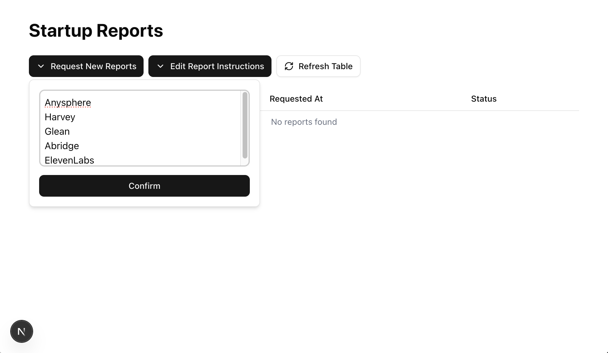
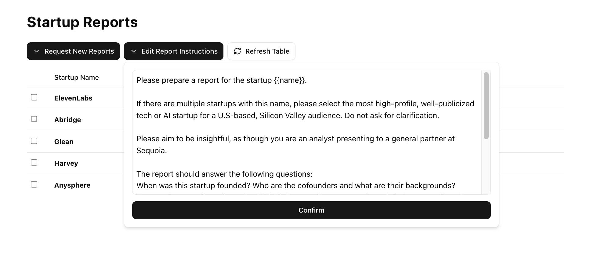
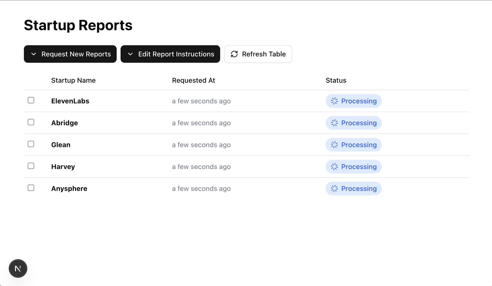
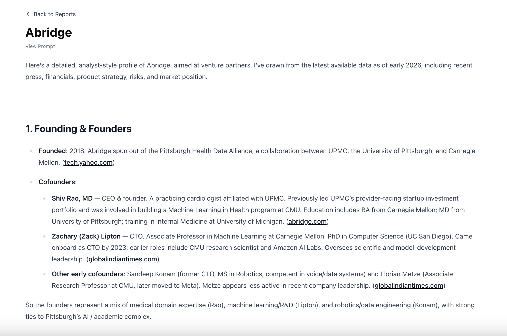

# AI Research Analyst

Request research reports for multiple startups.

Small personal project to explore prompt engineering and LLMs for research.

## Screenshots

Request reports for one or more startups.



Edit the prompt if desired. Prompts are versioned and linked to generated reports.



Report generation in the background with Airflow.



View generated report when finished.



## Local Development Setup

Start the frontend

```
cd frontend
npm run dev
```

Start the backend

```
cd backend
python manage.py runserver 8081
```

Start Airflow

```
cd airflow
./start_airflow.sh
```

Access the website at localhost:3000.
